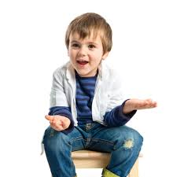

# HARSHIT GOYAL
## About me

I am Harshit Goyal, a BTech student at **IIT Goa**. I am doing *computer science engineering*.

## Education
------
| Year | Standard |School Name|
| :------ | :------ | :------|
|2006-2021|pre-nursery -12|Bhavan Vidyalya|
|2022|btech cse|IIT Goa|

## Course@IIT Goa
* **cs101** computer science-101 *Clint*
* [**cs102**](https://classroom.google.com/u/0/c/NTk1MTg5ODUxNDcz/a/NTE5MTc5NTc0Njk4/details) computer science-102 *Clint*
* [**ph102**](https://classroom.google.com/u/0/c/NTE2NDk5ODI5NTc0) intro to electrodynamics *Vaibhav*
* **ma102** maths algebra *kalpesh haria*

## Hobies and interests
1. playing basketball
2. playing football
3. solving maths problems
4. coding
5. watching movies

A famous quote 

> Yesterday is history ,

> Tommorow is a mystery, 

> Today is a gift, 

> That is why we call it present.

